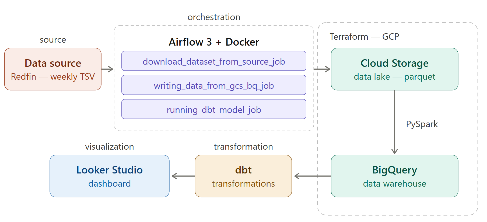
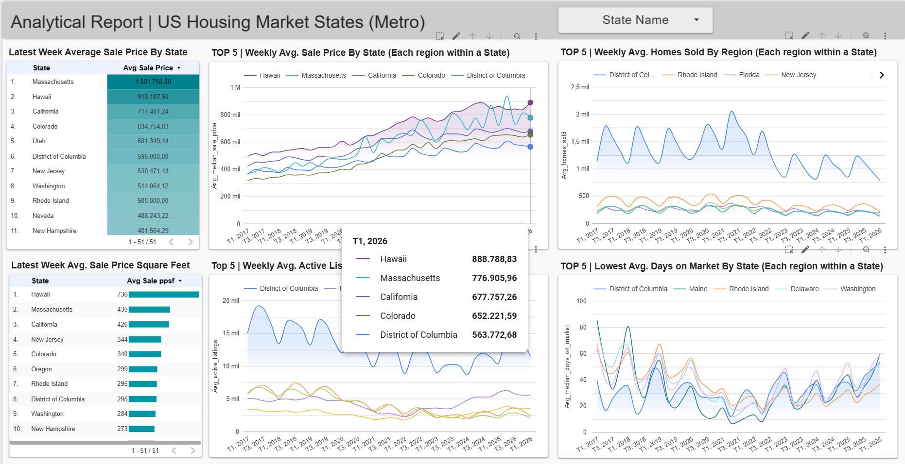
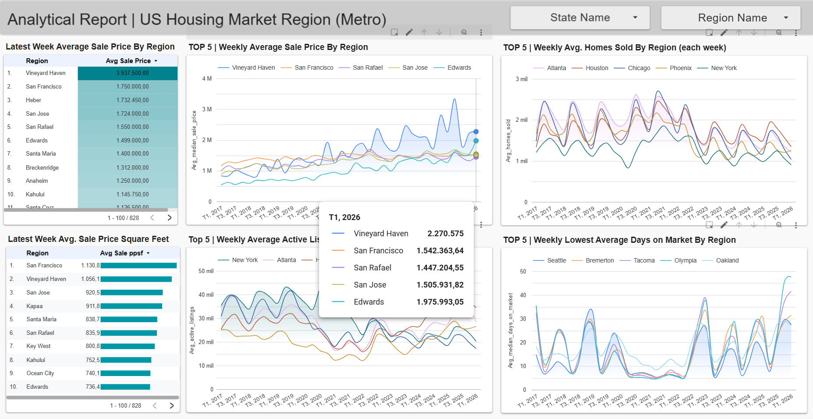
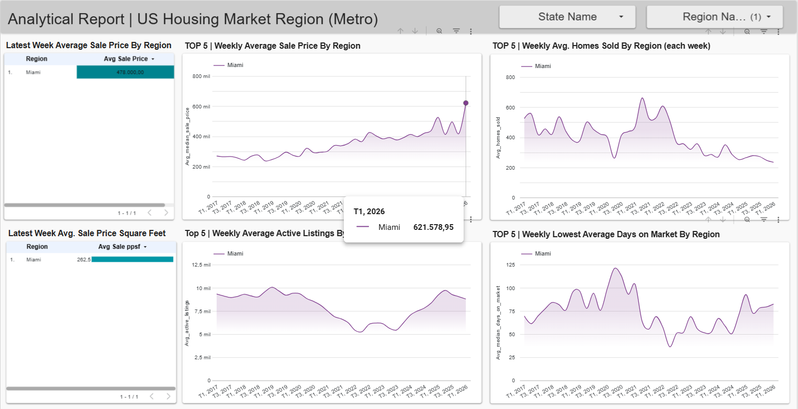
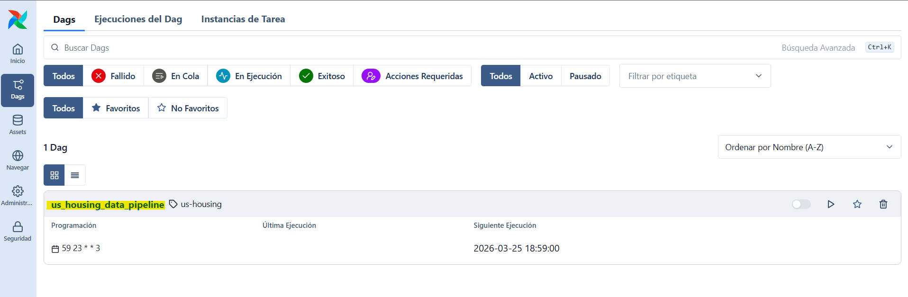
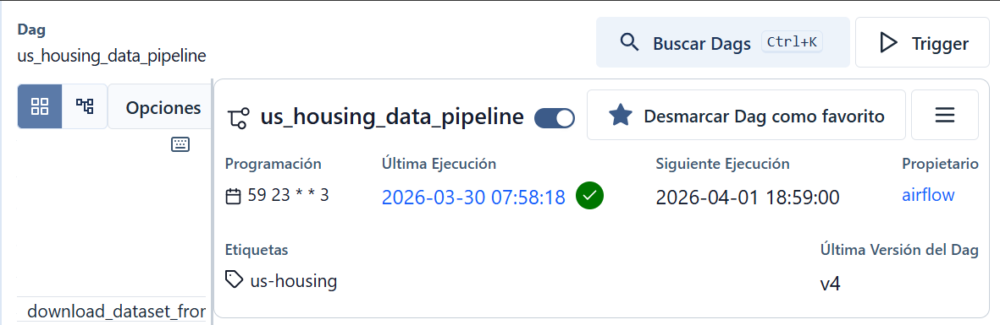
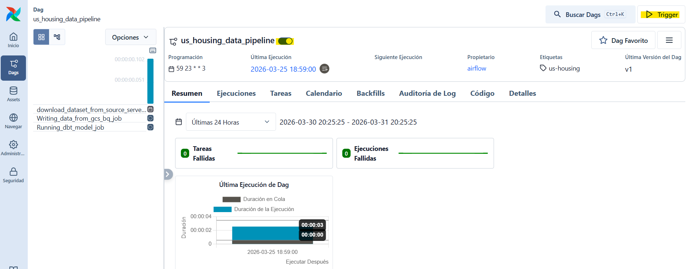
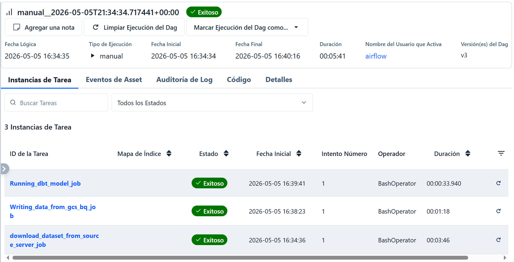

# 🏙️ US Housing Market Tracker | DE Zoomcamp 2026 Project

## Problem Description

The U.S. housing market generates enormous amounts of data every week across hundreds 
of regions and all 50 states. For buyers, sellers, investors, and real estate professionals, 
there is no simple way to monitor how the market is evolving across different geographies and 
time periods without spending significant time and resources collecting, processing, and analyzing 
it themselves.

This gap leads to a concrete problem: housing market decisions are made without 
visibility into trends. A buyer considering San Francisco vs. San Jose has no easy 
way to compare how median sale prices or days on market have shifted over the past 
9 years in each city. An investor evaluating states can't quickly identify that 
Massachusetts consistently leads in average sale price while Hawaii dominates in 
price per square foot. A seller in Phoenix doesn't know whether active listings in 
their metro are rising or shrinking relative to comparable markets like Atlanta or 
Chicago.

### What this project solves

This project addresses that problem by building an automated pipeline that ingests, 
transforms, and models Redfin's weekly housing market data, and exposes it through 
an interactive analytical dashboard with two levels of geographic analysis:

- 🗺️ **Metropolitan/State level** — aggregates metrics across all regions within each 
  state, allowing macro comparisons of market health, affordability, and competition 
  across the entire country.

- 📍 **Metropolitan/Region level** — ranks the top regions by average sale price, price 
  per square foot, homes sold, active listings, and days on market, with 9 years of 
  weekly trend lines (2017–2026) and filters by State and Region name.

Together, these views turn a fragmented, hard-to-use public dataset into a 
self-updating, drill-down market intelligence tool — answering in seconds questions 
that would otherwise require hours of manual data work.

---

## Project Architecture

---

## Project Structure

    📁 DE_zoomcamp_project_2026/
    ├── 📁 config/
    │   └── airflow.cfg                              # Airflow configuration file
    ├── 📁 dags/
    │   └── us_housing_data_pipeline.py              # Main Airflow DAG — orchestrates the 3 pipeline tasks
    ├── 📁 gcs_credentials/                          # ⚠️ gitignored — add your own credentials here
    │   └── service_account_creds.json               # GCP service account key
    ├── 📁 gcs_hadoop_conn/
    │   ├── gcs-connector-hadoop3-2.2.5.jar          # Spark connector for GCS
    │   └── spark-bigquery-with-dependencies_2.13-0.44.0.jar  # Spark connector for BigQuery
    ├── 📁 housing_market_data/                      # dbt project
    │   ├── 📁 models/
    │   │   ├── 📁 staging/                          # Raw source models — minimal transformation
    │   │   │   ├── stg_us_housing_data.sql
    │   │   │   └── bq_sources.yml                   # BigQuery source definitions
    │   │   ├── 📁 intermediate/                     # Logic transformations
    │   │   │   └── int_us_housing_data.sql
    │   │   └── 📁 marts/                            # Final models ready for reporting
    │   │       ├── dim_region.sql
    │   │       ├── dim_region_type.sql
    │   │       ├── dim_state.sql
    │   │       ├── fact_housing_data.sql             # Core fact table
    │   │       └── 📁 reporting/                    # Aggregated models for dashboard
    │   │           ├── aggregations_monthly.sql
    │   │           ├── aggregations_quarterly.sql
    │   │           ├── aggregations_weekly.sql
    │   │           └── sale_price_weekly.sql
    │   ├── 📁 seeds/
    │   │   └── us_states.csv                        # Static reference data for US states
    │   ├── 📁 macros/                               # Custom dbt macros
    │   ├── 📁 tests/                                # dbt data quality tests
    │   ├── 📁 snapshots/                            # dbt snapshots for SCD tracking
    │   ├── 📁 dbt_packages/
    │   │   └── dbt_utils/                           # dbt utility macros package
    │   ├── dbt_project.yml                          # dbt project configuration
    │   ├── packages.yml                             # dbt package dependencies
    │   └── README.md
    ├── 📁 src/
    │   └── 📁 jobs/
    │       ├── fetching_data.py                     # Downloads dataset from source and uploads to GCS
    │       └── gcs_to_bq.py                         # Spark job — reads from GCS and writes to BigQuery
    ├── 📁 terraform/
    │   ├── main.tf                                  # GCS bucket + BigQuery dataset provisioning
    │   └── variables.tf                             # Configurable infrastructure variables
    ├── 📁 pictures/                                 # Screenshots for README documentation
    ├── 📁 plugins/                                  # Custom Airflow plugins
    ├── dockerfile                                   # Custom Airflow + Spark image
    ├── docker-compose.yaml                          # Multi-container setup for Airflow services
    ├── requirements.txt                             # Python dependencies
    ├── pyproject.toml                               # Project metadata and build config
    ├── uv.lock                                      # Dependency lock file
    └── README.md

---

## ☁️ Cloud

For the development of this project, Google Cloud Platform (GCP) is used as the 
Cloud Service Provider. You must have previously created a GCP project, a service 
account, and generated a service account key to get access to all the resources in 
your Google Cloud.

Terraform is used to manage all the Cloud infrastructure as code, as well as for 
documentation and version control. The resources created were: the project bucket 
within the GCS data lake, where all the raw data is stored in .parquet format and 
partitioned leveraging Spark's distributed processing; and a dataset within the 
BigQuery data warehouse, where all the data fetched from the data lake is stored 
for further processing.

---

## 🔄 Data Ingestion: Batch Processing / Workflow Orchestration

The pipeline was designed to process batch data based on the dataset used for the 
development of this project. The Redfin US Housing Market Dataset is generated on 
a weekly basis every Wednesday with real estate data for the US market from the 
previous week.

The pipeline works in a completely automatic way and all jobs/tasks are fully 
orchestrated through a multi-step DAG using Airflow as the orchestrator:

- 📥 **Fetching data task:** The first task is a Spark Job that uses the GCS Connector 
  for Spark Hadoop to create a Spark Session running on a local Spark cluster. This 
  job processes all the raw data extracted from the source server (a generated link 
  address on the Redfin page where the data is accessible and updated every week). 
  The data is downloaded and stored locally in a temporary directory, from which 
  Spark reads the data in .tsv format (similar to .csv format but with tab-separated 
  values), applies an initial schema definition to the dataset — useful for further 
  partitioning and clustering — and finally writes the dataset to the Cloud external 
  path in .parquet format, also partitioned leveraging Spark's distributed processing 
  for large workloads (the dataset from 2017 to date contains approximately 
  5.6+ million rows).

- 🪣 **GCS to BQ task:** Once all raw data is stored in the data lake, another Spark 
  Job using the GCS and BigQuery connectors (both initialized when creating the Spark 
  Session) reads all the partitioned .parquet files. Before loading the data into 
  BigQuery, it is recommended to define an existing bucket as a temporary bucket — 
  or create a new one — for BigQuery to store the data temporarily, so that if the 
  BQ load fails, the raw file remains safe in GCS. Finally, the data is written to 
  the data warehouse partitioned by the `period_begin` field (date column) and 
  clustered by the `region_name` field (city/region name column).

- 🔧 **dbt model task:** The dbt model task in the DAG is responsible for cleaning, 
  transforming, modeling, and enriching the data through each of the defined stages 
  in the model: Staging, Intermediate, and Marts.

    ### ⛓️ Job dependencies
    fetching_data_job >> gcs_to_bq_job >> dbt_model_job

---

## 🗄️ Data Warehouse

As mentioned earlier, before storing the data into the data warehouse the 
consolidated table is partitioned and clustered in the following way:

- Partitioned by **period_begin**: This is critical because the dataset spans nearly 
  a decade of weekly housing market data (2017–2026). Since queries and dashboard 
  filters operate on specific time ranges, partitioning by date allows BigQuery to 
  skip irrelevant partitions entirely and scan only the time window needed, 
  dramatically reducing query costs and execution time.

- Clustered by **region_name**: This further optimizes performance within each 
  partition. Since the dashboard heavily filters and ranks data by region/city 
  (comparing metros like San Francisco, Atlanta, or Phoenix), BigQuery can co-locate 
  rows from the same region on the same storage blocks. This means that queries 
  filtering or grouping by region scan significantly less data, making the ranking 
  tables and trend line charts in the reports faster and more cost-efficient to 
  compute.

---

## ⚙️ Transformations

All pipeline transformations were performed through a structured dbt model where 
each layer/stage is well defined:

- **Staging** (`stg_us_housing_data.sql`): The first layer reads directly from 
  the raw BigQuery table defined in `bq_sources.yml`. It applies basic cleaning 
  such as renaming columns and casting data types to produce a standardized and 
  consistent base model that all downstream models depend on.

- **Intermediate** (`int_us_housing_data.sql`): This layer applies business logic 
  transformations on top of the staging model, such as deriving calculated fields, 
  joining related datasets/seeds, deduplicating, filtering null values, and 
  preparing the data for dimensional modeling.

- ⭐ **Marts** — Dimensional Models: This layer implements a **star schema** structure 
  with dedicated dimension and fact tables:
    - `dim_region.sql` — Contains the region attributes
    - `dim_region_type.sql` — Classifies regions by type (county or metro)
    - `dim_state.sql` — Contains state-level attributes enriched using fields from 
      the `us_states` seed (state name, region, and division)
    - `fact_housing_data.sql` — The central fact table containing all housing market 
      records and quantitative metrics that can be joined to the dimension tables

- 📊 **Marts** — Reporting Models: The final layer pre-aggregates the fact and dimension 
  tables into ready-to-query reporting tables that directly power the dashboard:
    - `sale_price_weekly.sql` — A focused weekly aggregations model used directly 
      for the multiple charts and tables in the dashboard.

This layered approach ensures **data quality is enforced early**, **ogic 
is centralized** in one place, and the **dashboard always queries pre-aggregated, 
optimized models** rather than hitting the raw data directly.

---

## 📈 Dashboard

#### 🗺️ US Housing Market State (Metropolitan)

#### 📍 US Housing Market Region (Metropolitan)

#### 🔎 Filtering By Region/State

#### 🔗 Access to the report
The final version of the dashboard is accessible at the following URL:  
https://lookerstudio.google.com/s/kMEl555lQmI

---

## 🚀 Reproducibility: Requirements

Although the pipeline uses Spark for the Spark Jobs, it is not necessary to install 
Scala or Spark on your machine, because all requirements are pre-configured in the 
`docker-compose.yaml`, which is built using a custom Dockerfile based on an Airflow 
Docker image where all programs and dependencies are set up to be installed when 
building and starting the Airflow containers. The Spark Hadoop connectors for GCS 
and BigQuery are already stored within the project and mounted as a volume inside 
the container, so no additional drivers need to be installed.

### Required:
- Docker installed
- Create a directory `gcs_credentials/service_account_creds.json` and place your credentials in the `.json` file
- Terraform installed and Cloud infrastructure configured (with the required cloud account permissions); You can use the variables.tf file and just modified the default values.
- Create an environment variables file (`.env`)

### Run the pipeline with the following steps:

Clone the repository to a directory on your host machine:

    git clone <repo-name>
  
Create a directory to stored your credentials with the following name: 

    mkdir -p gcs_credentials && touch gcs_credentials/service_account_creds.json

Create a new `.env` file with the following variables defined:

    # Airflow environment variables
    AIRFLOW_UID= 50000
    AIRFLOW_HOME= /opt/airflow

    # Cloud environment variables
    GCS_CREDENTIALS= /gcs_credentials/service_account_creds.json # No modify this, just make sure the file is in the right location
    PROJECT_ID= add_your_project_id_here
    LOCATION= add_your_location_here eg. US - EU
    BUCKET_NAME= add_your_bucket_name_here
    DATASET_NAME= add_your_bq_dataset_name_here

Within the project directory where your `docker-compose.yaml` is located, execute the 
following to build and run the Airflow containers:

    # Build the containers
    docker compose build

    # Run all Airflow containers
    docker compose up

    # Run all Airflow containers in detached mode
    docker compose up -d

Wait until all containers are running and healthy. You can verify their status with:

    docker compose ps

When the `airflow-apiserver` container is up and healthy, open the Airflow UI on 
port 8080:

http://localhost:8080

Go to the DAGs section and select the pipeline `us_housing_data_pipeline`.

For the first DAG execution when you Toggle the switch next to the pipeline name it will then begin executing

After that, when you want run it manually you need to select **'Trigger'** on the upper-right corner.
In the window that opens, select **'Unique execution'** and click **'Trigger'** 
again. 

While the pipeline is running, you can monitor the logs of all 3 tasks to identify what each process is performing. During the Spark job execution (Tasks 1 and 2), you can also visualize how data is being processed through the Spark UI available on port 4040:

http://localhost:4040

Depending on your local resources, you can modify the driver and executor memory within the Spark Config Session (inside each Spark Job) to adjust to your machine's resources. It is recommended to run the pipeline on a machine with 4 cores and 16GB of RAM, or use a virtual machine with enough resources (already tested on a VM, executing in 8 to 10 minutes). Otherwise, it may take longer to finish the entire execution (20+ minutes) or crash during the process.

    # Allocate memory depending on your available resources. Below are the default configured values: 
    .set("spark.driver.memory", "4g") 
    .set("spark.executor.memory", "4g")

Once the pipeline finishes successfully, the entire infrastructure will be fully provisioned and ready to use.

## 🛠️ Future improvements

To significantly improve the pipeline's performance, the following enhancements will be added:
- Create a Dataproc cluster on GCP where all Spark jobs can be submitted for processing in an isolated environment, leveraging the cluster's dedicated resources.
- Design an incremental strategy to process only newly added records, avoiding reprocessing the entire historical dataset on each execution.

---
